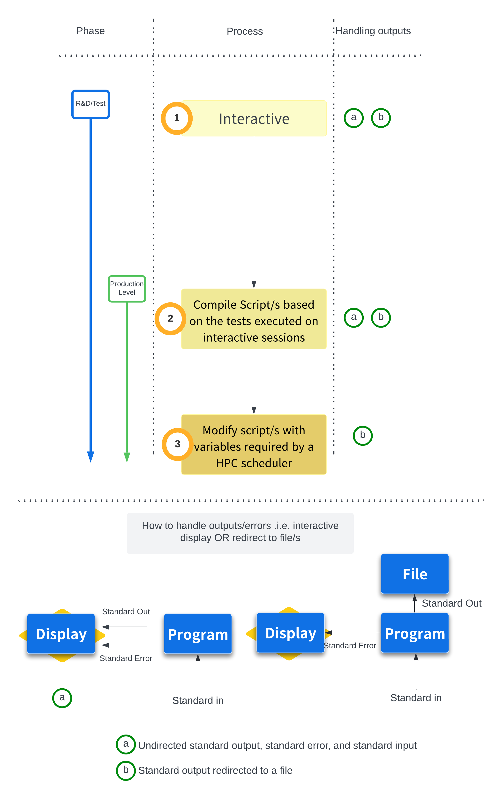

# Background

!!! rectangle-list "Primary objective of this workshop"

    - Developing a Pipeline/Workflow starting from "Interactive" testing/debugging on the command line, to writing bash "Scripts" for better handling and make the process more reproducible, to "Scaling on Clusters with Scripts with variables for Schedulers"

Doing good genomics research is about more than mastering the bioinformatic steps of a pipeline — it also means learning to use computational resources efficiently and effectively. As datasets grow larger and analyses become more complex, the ability to move beyond ad-hoc commands and toward structured, scalable workflows becomes an essential skill in its own right.

In this workshop, we will work through a subset of the analysis pipelines covered in the RNA-seq and Variant Calling workshops, using it as a practical foundation to build these skills progressively.

We begin at the command line, running each step of the analysis interactively. This is the natural starting point for any new pipeline: a place to explore, test, and debug before committing to anything more permanent. From there, we'll take what we've learned and translate it into a **bash script** — a plain text file that captures our commands in order, creating a record of exactly what was run and making the analysis far easier to reproduce or share with others.

Finally, we'll go one step further and introduce **HPC job scheduling**. Most serious genomics workflows require more memory, CPU, or time than a standard interactive session allows. We'll learn how to convert our bash script into a **SLURM job script**, explore the key variables and directives needed to submit a job to a cluster, and discuss strategies for scaling up to even more computationally demanding analyses.

By the end of the workshop, you'll have a practical workflow that takes you all the way from a handful of typed commands to a reproducible, cluster-ready pipeline.

