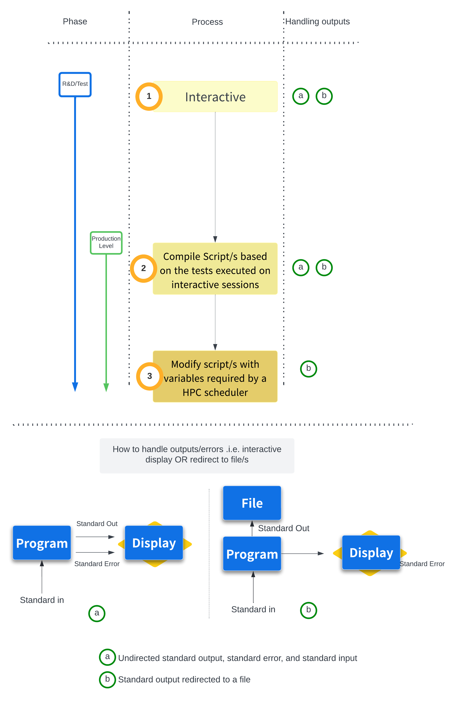

# Background

!!! rectangle-list "Primary objective of this workshop"

    - Illustrate the step by step process for developing a Pipeline/Workflow
        - Developing a Pipeline/Workflow starting from "Interactive" testing/debugging TO "Scripts" for better handling and make the process more reproducible TO "Scaling on Clusters with Scripts with variables for Schedulers"

