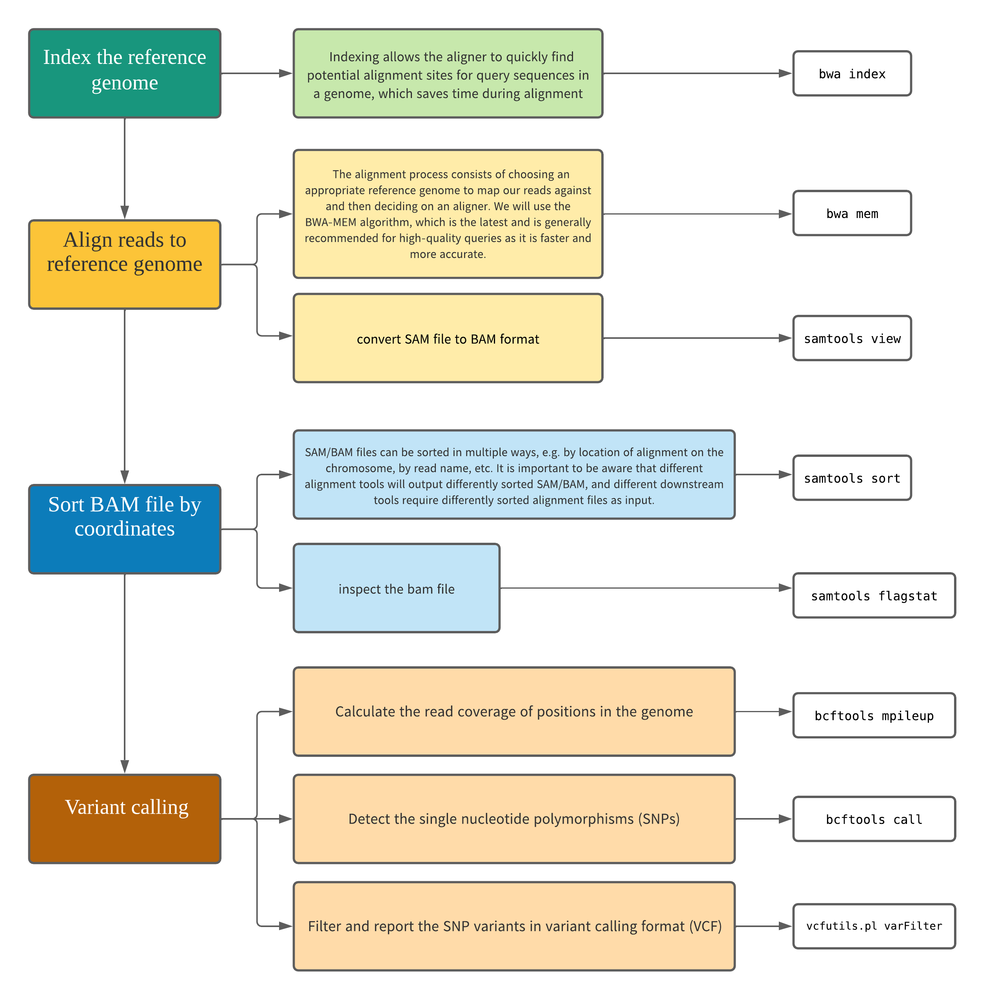

# Variant Calling Workflow

This material is extracted from the [Genomics Data Carpentry Lesson](https://datacarpentry.org/genomics-workshop/)

!!! abstract "Objectives and overall workflow"

    - Understand and perform the steps involved in variant calling.
    - Describe the types of data formats encountered during variant calling.
    - Use command line tools to perform variant calling.


<center>
{width="800"}
</center>


!!! note "Assumptions"

    - You have already performed trimming and filtering of your reads and saved in a directory called trimmed_reads.
    - You have a reference genome saved in a directory called `ref_genome`.

In this workshop, we have already trimmed the reads and downloaded the reference genome for you.
First, it is always good to verify where we are:

!!! terminal "script"

    ```bash
    cd ~
    ```
    ```bash
    pwd
    ```
    **Output** -  `/home/yourusername`

Checking to make sure we have the directory and files for the workshop.

!!! terminal "script"

    ```bash
    ls
    ```

    - You should see a directory names `/scripting_workshop`

!!! code-compare "Quick Check"
    If you do not have the workshop directory, you can copy it using the command: `cp -r  /nesi/project/nesi02659/scripting_workshop/ ~`  

!!! terminal "script"

    ```bash
    cd scripting_workshop/variant_calling
    ```
    ```bash
     ls
    ```
    **Output** -  `ref_genome  trimmed_reads` 
## Alignment to a reference genome
First we need to create directories for the results that will be generated as part of this workflow. We can do this in a single line of code, because mkdir can accept multiple new directory names as input.

!!! terminal "script"

    ```bash
    mkdir -p results/sam results/bam results/bcf results/vcf
    ```
### Index the reference genome
Our first step is to index the reference genome for use by BWA. Indexing allows the aligner to quickly find potential alignment sites for query sequences in a genome, which saves time during alignment. Indexing the reference only has to be run once. The only reason you would want to create a new index is if you are working with a different reference genome or you are using a different tool for alignment.

Since we are working on the NeSI HPC, we need to search and load the package before we start using it.

!!! info "Software as modules"
    - 

!!! terminal "script"

    ```bash
    #Search for a module
    module spider bwa
    ```
    ```bash
    #Load BWA module
    module purge
    module load BWA/0.7.17-GCC-9.2.0
    ```

indexing the genome
!!! terminal "script"

    ```bash
    bwa index ref_genome/ecoli_rel606.fasta
    ```
??? success "Output"
    ```bash
    [bwa_index] Pack FASTA... 0.03 sec
    [bwa_index] Construct BWT for the packed sequence...
    [bwa_index] 1.04 seconds elapse.
    [bwa_index] Update BWT... 0.03 sec
    [bwa_index] Pack forward-only FASTA... 0.02 sec
    [bwa_index] Construct SA from BWT and Occ... 0.57 sec
    [main] Version: 0.7.17-r1188
    [main] CMD: bwa index ref_genome/ecoli_rel606.fasta
    [main] Real time: 2.462 sec; CPU: 1.702 sec
    ```
### Align reads to reference genome
The alignment process consists of choosing an appropriate reference genome to map our reads against and then deciding on an aligner. We will use the BWA-MEM algorithm, which is the latest and is generally recommended for high-quality queries as it is faster and more accurate.
We are going to start by aligning the reads from just one of the samples in our dataset (SRR2584866).

!!! terminal "script"
    ```bash
    bwa mem ref_genome/ecoli_rel606.fasta trimmed_reads/SRR2584866_1.trim.sub.fastq trimmed_reads/SRR2584866_2.trim.sub.fastq > results/sam/SRR2584866.aligned.sam
    ```
    ??? success "Output"
        ```
        [M::bwa_idx_load_from_disk] read 0 ALT contigs
        [M::process] read 77446 sequences (10000033 bp)...
        [M::process] read 77296 sequences (10000182 bp)...
        [M::mem_pestat] # candidate unique pairs for (FF, FR, RF, RR): (48, 36728, 21, 61)
        [M::mem_pestat] analyzing insert size distribution for orientation FF...
        [M::mem_pestat] (25, 50, 75) percentile: (420, 660, 1774)
        [M::mem_pestat] low and high boundaries for computing mean and std.dev: (1, 4482)
        .....
        ```
!!! terminal "script"

    ```bash
    ls results/sam/
    ```
    **Output** - `SRR2584866.aligned.sam` 

#### SAM/BAM format
The SAM file, is a tab-delimited text file that contains information for each individual read and its alignment to the genome. While we do not have time to go into detail about the features of the SAM format, the paper by [Heng Li et al.](https://academic.oup.com/bioinformatics/article/25/16/2078/204688) provides a lot more detail on the specification.

The compressed binary version of SAM is called a BAM file. We use this version to reduce size and to allow for indexing, which enables efficient random access of the data contained within the file.

We will convert the SAM file to BAM format using the samtools program with the view command and tell this command that the input is in SAM format (-S) and to output BAM format (-b):

We will convert the SAM file to BAM format using the samtools program with the view command and tell this command that the input is in SAM format (-S) and to output BAM format (-b):

!!! terminal "script"
    ```bash
    module load SAMtools/1.13-GCC-9.2.0
    ```
    ```bash
    samtools view -S -b results/sam/SRR2584866.aligned.sam > results/bam/SRR2584866.aligned.bam
    ```

#### Sort BAM file by coordinates
Next we sort the BAM file using the `sort` command from samtools. -o tells the command where to write the output.

!!! terminal

    ```bash
    samtools sort -o results/bam/SRR2584866.aligned.sorted.bam results/bam/SRR2584866.aligned.bam
    ```

!!! tip "Sorting"

    SAM/BAM files can be sorted in multiple ways, e.g. by location of alignment on the chromosome, by read name, etc. It is important to be aware that different alignment tools will output differently sorted SAM/BAM, and different downstream tools require differently sorted alignment files as input.

You can use samtools to learn more about this bam file as well.

!!! terminal "script"

    ```bash
    samtools flagstat results/bam/SRR2584866.aligned.sorted.bam
    ```

## Variant calling
A variant call is a conclusion that there is a nucleotide difference vs. some reference at a given position in an individual genome or transcriptome, often referred to as a Single Nucleotide Variant (SNV). The call is usually accompanied by an estimate of variant frequency and some measure of confidence. Similar to other steps in this workflow, there are a number of tools available for variant calling. In this workshop we will be using `bcftools`, but there are a few things we need to do before actually calling the variants.

### Step 1: Calculate the read coverage of positions in the genome
Do the first pass on variant calling by counting read coverage with `bcftools`. We will use the command mpileup. The flag -O b tells bcftools to generate a bcf format output file, -o specifies where to write the output file, and -f flags the path to the reference genome:

!!! terminal "script"
    ```bash
    module load BCFtools/1.13-GCC-9.2.0
    ```
    ```bash
    bcftools mpileup -O b -o results/bcf/SRR2584866_raw.bcf -f ref_genome/ecoli_rel606.fasta results/bam/SRR2584866.aligned.sorted.bam
    ```

    ??? success "Output"

        [mpileup] 1 samples in 1 input files
        [mpileup] maximum number of reads per input file set to -d 250

We have now generated a file with coverage information for every base.

### Step 2: Detect the single nucleotide variants (SNVs)
Identify SNVs using bcftools call. We have to specify ploidy with the flag `--ploidy`, which is one for the haploid E. coli. -m allows for multiallelic and rare-variant calling, -v tells the program to output variant sites only (not every site in the genome), and -o specifies where to write the output file:

!!! terminal "script"

    ```bash
    bcftools call --ploidy 1 -m -v -o results/vcf/SRR2584866_variants.vcf results/bcf/SRR2584866_raw.bcf 
    ```

### Step 3: Filter and report the SNV variants in variant calling format (VCF)
Filter the SNVs for the final output in VCF format, using `vcfutils.pl`:

!!! terminal "script"

    ```bash
    vcfutils.pl varFilter results/vcf/SRR2584866_variants.vcf > results/vcf/SRR2584866_final_variants.vcf
    ```

### Explore the VCF format:

!!! quote ""

    - At this stage you can use various tools to analyse the vcf file. 
    - Exploring the vcf is beyond the scope of this workshop. Please refer to [official documentation on VCF provided by Broad Institute](]https://gatk.broadinstitute.org/hc/en-us/articles/360035531692-VCF-Variant-Call-Format)

Now we are ready for the [Next Lesson](2_AutomaticVariantC.md) to put all these commands in a script.

