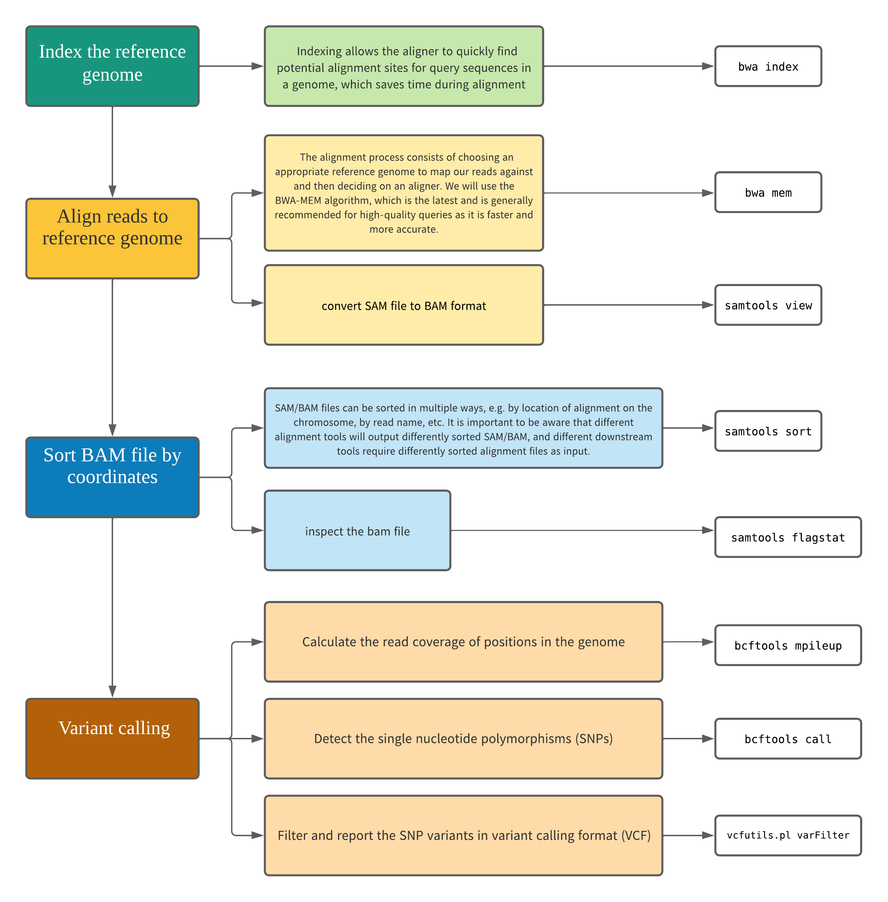

# Variant Calling Workflow

This material is extracted from the [Genomics Data Carpentry Lesson](https://datacarpentry.org/genomics-workshop/)

!!! clipboard-list "Objectives and overall workflow"

    - Understand and perform the steps involved in variant calling.
    - Describe the types of data formats encountered during variant calling.
    - Use command line tools to perform variant calling.


{.center width="800"}


!!! square-pen "Assumptions"

    - You have already performed trimming and filtering of your reads and saved them in a directory called `trimmed_reads`.
    - You have a reference genome saved in a directory called `ref_genome`.

In this workshop we have already trimmed the reads and downloaded the reference genome for you.
First, it is always good to verify where we are:

!!! terminal "script"

    ```bash
    cd ~
    ```
    ```bash
    pwd
    ```
    **Output**:  `/home/$USER`

    !!! quote ""
        - You should see your own **username** in place of `$USER`
        - FYI: `$USER` is not an arbitrary string as it is a real environment variable. Run `echo $USER` and see what happens 


!!! terminal-2 "Checking to make sure we have the directory and files for the workshop."

    ```bash
    ls
    ```

    - You should see a directory named `/scripting_workshop`

 

!!! terminal "script"

    ```bash
    cd scripting_workshop/variant_calling
    ```
    ```bash
    ls
    ```
    **Output**:  `ref_genome  trimmed_reads` 

## Modules on the HPC

Similar to other HPCs/SuperComputers, REANNZ Clusters provide software as modules (this is not the only way to deploy software as it can be done via other means such as conda, containers, etc.).  

 - A module is a self-contained description of a software package — it contains the settings required to run a software package and, usually, encodes required dependencies on other software packages.  

- Refer to [supplementary 1 - Accessing software via modules](https://genomicsaotearoa.github.io/Workshop-Bash_Scripting_And_HPC_Job_Scheduler/ 6_supplementary_1/) for more information. 

Let's search for the first software we'll need called "Burrows-Wheeler Aligner" or BWA.  

!!! terminal "script"

    ```bash
    #Search for a module. Module spider is not case-sensitive. 
    module spider bwa
    ```
    !!! circle-check "Output - this will change as new versions are added"
        ```bash
        -------------------------------------------------------------------------------------------------
        BWA:
        -------------------------------------------------------------------------------------------------
        Description:
        Burrows-Wheeler Aligner (BWA) is an efficient program that aligns relatively short
        nucleotide sequences against a long reference sequence such as the human genome.

        Versions:
        BWA/0.7.17-GCC-7.4.0
        BWA/0.7.17-GCC-9.2.0
        BWA/0.7.17-GCC-11.3.0
        BWA/0.7.18-GCC-12.3.0

        -------------------------------------------------------------------------------------------------
        For detailed information about a specific "BWA" package (including how to load the modules) use the module's full name.
        Note that names that have a trailing (E) are extensions provided by other modules.
        For example:

        $ module spider BWA/0.7.18-GCC-12.3.0
        -------------------------------------------------------------------------------------------------
        ```

Now run module purge, then module load the most recent version of BWA:

!!! terminal "script"

    ```bash
    #Load BWA module
    module purge
    module load BWA/0.7.18-GCC-12.3.0
    ```

!!! square-pen "Note"

    It's a good idea to run `module purge` first, to make sure you don't get dependency clashes. Each module you load are set up by the HPC maintainers to also pull in any software dependencies they need. As multiple modules can need the same software dependencies, but may be linked to different versions of that software, it's safer to purge first. 

??? tip "Tip: All-In-One module load"
    We will be needing a few modules for this episode and the RNA-Seq Mapping episode. If you would like to load all of them at once, you could run the following command:
    ```bash
    source ~/scripting_workshop/modload.sh
    ```
    ??? circle-check "Output"
        ```bash
        The following modules were not unloaded:
        (Use "module --force purge" to unload all):

        1) XALT/minimal   2) slurm   
        Loaded modules BWA, SAMtools, BCFtools,HISAT2,Subread
        ```
        
        - Please **do not** run `module --force purge` under any circumstances

To see all of your currently loaded modules, run:
!!! terminal "script"

    ```bash
    module list
    ```
    !!! circle-check  "Output"
        ```bash
        Currently Loaded Modules:
        1) NeSI/zen3 (S)   2) GCCcore/12.3.0   3) zlib/1.2.13-GCCcore-12.3.0   4) binutils/2.40-GCCcore-12.3.0   5) GCC/12.3.0   6) BWA/0.7.18-GCC-12.3.0

        Where:
        S:  Module is Sticky, requires --force to unload or purge
        ```
    - You'll see multiple software dependencies have now loaded not just BWA! 
    - Please **do not** use `$ module --force purge`

## Alignment to a reference genome
First we need to create directories for the results that will be generated as part of this workflow. We can do this in a single line of code, because mkdir can accept multiple new directory names as input.

!!! terminal "script"

    ```bash
    mkdir -p results/sam results/bam results/bcf results/vcf
    ```

    - Another quick and easy way to create multiple directories reside within the same parent directory is to wrap them with `{}` (comma separated) e.g., 
    ```bash
    mkdir -p results/{sam,bam,bcf,vcf}
    ```
### Index the reference genome
Our first step is to index the reference genome for use by BWA. Indexing allows the aligner to quickly find potential alignment sites for query sequence in a genome, which saves time during alignment. Indexing the reference only has to be run once. The only reason you would want to create a new index is if you are working with a different reference genome or you are using a different tool for alignment.

Since we are working on the REANNZ HPC, we need to search and load the package before we start using it.


!!! terminal-2 "Indexing the genome"

    ```bash
    bwa index ref_genome/ecoli_rel606.fasta
    ```
    ??? circle-check "Output"
        ```bash
        [bwa_index] Pack FASTA... 0.03 sec
        [bwa_index] Construct BWT for the packed sequence...
        [bwa_index] 1.04 seconds elapse.
        [bwa_index] Update BWT... 0.03 sec
        [bwa_index] Pack forward-only FASTA... 0.02 sec
        [bwa_index] Construct SA from BWT and Occ... 0.57 sec
        [main] Version: 0.7.17-r1188
        [main] CMD: bwa index ref_genome/ecoli_rel606.fasta
        [main] Real time: 2.462 sec; CPU: 1.702 sec
        ```
### Align reads to reference genome
The alignment process consists of choosing an appropriate reference genome to map our reads against and then deciding on an aligner. We will use the BWA-MEM algorithm, which is the latest and is generally recommended for high-quality queries as it is faster and more accurate.
We are going to start by aligning the reads from just one of the samples in our dataset (SRR2584866).

!!! terminal "script"
    ```bash
    bwa mem ref_genome/ecoli_rel606.fasta trimmed_reads/SRR2584866_1.trim.sub.fastq trimmed_reads/SRR2584866_2.trim.sub.fastq > results/sam/SRR2584866.aligned.sam
    ```
    ??? circle-check "Output"
        ```
        [M::bwa_idx_load_from_disk] read 0 ALT contigs
        [M::process] read 77446 sequences (10000033 bp)...
        [M::process] read 77296 sequences (10000182 bp)...
        [M::mem_pestat] # candidate unique pairs for (FF, FR, RF, RR): (48, 36728, 21, 61)
        [M::mem_pestat] analyzing insert size distribution for orientation FF...
        [M::mem_pestat] (25, 50, 75) percentile: (420, 660, 1774)
        [M::mem_pestat] low and high boundaries for computing mean and std.dev: (1, 4482)
        .....
        [main] CMD: bwa mem ref_genome/ecoli_rel606.fasta trimmed_reads/SRR2584866_1.trim.sub.fastq trimmed_reads/SRR2584866_2.trim.sub.fastq
        [main] Real time: 12.234 sec; CPU: 12.434 sec

        ```
!!! terminal "script"

    ```bash
    ls results/sam/
    ```
    **Output** - `SRR2584866.aligned.sam` 

#### SAM/BAM format
The SAM file is a tab-delimited text file that contains information for each individual read and it's alignment to the genome. While we do not have time to go into detail about the features of the SAM format, the paper by [Heng Li et al.](https://academic.oup.com/bioinformatics/article/25/16/2078/204688) provides a lot more detail on the specification.

The compressed binary version of SAM is called a BAM file. We use this version to reduce size and to allow for indexing, which enables efficient random access of the data contained within the file.

We will convert the SAM file to BAM format using the samtools program with the view command and tell this command that the input is in SAM format (-S) and to output BAM format (-b):

!!! terminal "script"
    ```bash
    module load SAMtools/1.22-GCC-12.3.0
    ```
    ```bash
    samtools view -S -b results/sam/SRR2584866.aligned.sam > results/bam/SRR2584866.aligned.bam
    ```

#### Sort BAM file by coordinates
Next we sort the BAM file using the `sort` command from samtools. The -o flag tells the command where to write the output.

!!! terminal

    ```bash
    samtools sort -o results/bam/SRR2584866.aligned.sorted.bam results/bam/SRR2584866.aligned.bam
    ```

!!! tip "Sorting"

    SAM/BAM files can be sorted in multiple ways, e.g. by location of alignment on the chromosome, by read name, etc. It is important to be aware that different alignment tools will output differently sorted SAM/BAM, and different downstream tools require differently sorted alignment files as input.


!!! terminal-2 "You can use samtools to learn more about the bam file."

    ```bash
    samtools flagstat results/bam/SRR2584866.aligned.sorted.bam
    ```
    
    ??? circle-check "Output"
        ```
        351169 + 0 in total (QC-passed reads + QC-failed reads)
        350000 + 0 primary
        0 + 0 secondary
        1169 + 0 supplementary
        0 + 0 duplicates
        0 + 0 primary duplicates
        351103 + 0 mapped (99.98% : N/A)
        349934 + 0 primary mapped (99.98% : N/A)
        350000 + 0 paired in sequencing
        175000 + 0 read1
        175000 + 0 read2
        346688 + 0 properly paired (99.05% : N/A)
        349876 + 0 with itself and mate mapped
        58 + 0 singletons (0.02% : N/A)
        0 + 0 with mate mapped to a different chr
        0 + 0 with mate mapped to a different chr (mapQ>=5)
        ```


## Variant calling
A variant call is a conclusion that there is a nucleotide difference relative to a given reference at a given position in an individual genome or transcriptome, often referred to as a Single Nucleotide Variant (SNV). The call is usually accompanied by an estimate of variant frequency and some measure of confidence. Similar to other steps in this workflow, there are a number of tools available for variant calling. In this workshop we will be using `bcftools`, but there are a few things we need to do before actually calling the variants.

### Step 1: Calculate the read coverage of positions in the genome
Do the first pass on variant calling by counting read coverage with `bcftools`. We will use the command mpileup. The flag -O b tells bcftools to generate a bcf format output file, -o specifies where to write the output file, and -f specifies the path to the reference genome:

!!! terminal "script"
    ```bash
    module load BCFtools/1.22-GCC-12.3.0
    ```
    ```bash
    bcftools mpileup -O b -o results/bcf/SRR2584866_raw.bcf -f ref_genome/ecoli_rel606.fasta results/bam/SRR2584866.aligned.sorted.bam
    ```

    ??? circle-check "Output"

        [mpileup] 1 samples in 1 input files
        [mpileup] maximum number of reads per input file set to -d 250

We have now generated a file with coverage information for every base.

### Step 2: Detect the single nucleotide variants (SNVs)
Identify SNVs using bcftools call. We have to specify ploidy with the flag `--ploidy`, which is one for the haploid *E. coli*. -m allows for multiallelic and rare-variant calling, -v tells the program to output variant sites only (not every site in the genome), and -o specifies where to write the output file:

!!! terminal "script"

    ```bash
    bcftools call --ploidy 1 -m -v -o results/vcf/SRR2584866_variants.vcf results/bcf/SRR2584866_raw.bcf 
    ```

### Step 3: Filter and report the SNV variants in variant calling format (VCF)


!!! terminal-2 "Filter the SNVs for the final output in VCF format, using `vcfutils.pl`:"

    ```bash
    vcfutils.pl varFilter results/vcf/SRR2584866_variants.vcf > results/vcf/SRR2584866_final_variants.vcf
    ```

### Explore the VCF format:


!!! terminal-2 "Quick look with head:"
    ```bash
    head -n 50 SRR2584866_final_variants.vcf
    ```

    ??? circle-check "Output"

        ```
        ##fileformat=VCFv4.2
        ##FILTER=<ID=PASS,Description="All filters passed">
        ##bcftoolsVersion=1.22+htslib-1.22
        ##bcftoolsCommand=mpileup -O b -o results/bcf/SRR2584866_raw.bcf -f ref_genome/ecoli_rel606.fasta results/bam/SRR2584866.aligned.sorted.bam
        ##reference=file://ref_genome/ecoli_rel606.fasta
        ##contig=<ID=CP000819.1,length=4629812>
        ##ALT=<ID=*,Description="Represents allele(s) other than observed.">
        ##INFO=<ID=INDEL,Number=0,Type=Flag,Description="Indicates that the variant is an INDEL.">
        ##INFO=<ID=IDV,Number=1,Type=Integer,Description="Maximum number of raw reads supporting an indel">
        ##INFO=<ID=IMF,Number=1,Type=Float,Description="Maximum fraction of raw reads supporting an indel">
        ##INFO=<ID=DP,Number=1,Type=Integer,Description="Raw read depth">
        ##INFO=<ID=VDB,Number=1,Type=Float,Description="Variant Distance Bias for filtering splice-site artefacts in RNA-seq data (bigger is better)",Version="3">
        ##INFO=<ID=RPBZ,Number=1,Type=Float,Description="Mann-Whitney U-z test of Read Position Bias (closer to 0 is better)">
        ##INFO=<ID=MQBZ,Number=1,Type=Float,Description="Mann-Whitney U-z test of Mapping Quality Bias (closer to 0 is better)">
        ##INFO=<ID=BQBZ,Number=1,Type=Float,Description="Mann-Whitney U-z test of Base Quality Bias (closer to 0 is better)">
        ##INFO=<ID=MQSBZ,Number=1,Type=Float,Description="Mann-Whitney U-z test of Mapping Quality vs Strand Bias (closer to 0 is better)">
        ##INFO=<ID=SCBZ,Number=1,Type=Float,Description="Mann-Whitney U-z test of Soft-Clip Length Bias (closer to 0 is better)">
        ##INFO=<ID=SGB,Number=1,Type=Float,Description="Segregation based metric, http://samtools.github.io/bcftools/rd-SegBias.pdf">
        ##INFO=<ID=MQ0F,Number=1,Type=Float,Description="Fraction of MQ0 reads (smaller is better)">
        ##FORMAT=<ID=PL,Number=G,Type=Integer,Description="List of Phred-scaled genotype likelihoods">
        ##FORMAT=<ID=AD,Number=R,Type=Integer,Description="Allelic depths (high-quality bases)">
        ##FORMAT=<ID=GT,Number=1,Type=String,Description="Genotype">
        ##INFO=<ID=AC,Number=A,Type=Integer,Description="Allele count in genotypes for each ALT allele, in the same order as listed">
        ##INFO=<ID=AN,Number=1,Type=Integer,Description="Total number of alleles in called genotypes">
        ##INFO=<ID=DP4,Number=4,Type=Integer,Description="Number of high-quality ref-forward , ref-reverse, alt-forward and alt-reverse bases">
        ##INFO=<ID=MQ,Number=1,Type=Integer,Description="Average mapping quality">
        ##bcftools_callVersion=1.22+htslib-1.22
        ##bcftools_callCommand=call --ploidy 1 -m -v -o results/vcf/SRR2584866_variants.vcf results/bcf/SRR2584866_raw.bcf; Date=Fri Aug 14 11:29:56 2026
        #CHROM  POS     ID      REF     ALT     QUAL    FILTER  INFO    FORMAT  results/bam/SRR2584866.aligned.sorted.bam
        CP000819.1      1521    .       C       T       207.417 .       DP=9;VDB=0.99088;SGB=-0.662043;MQSBZ=0;MQ0F=0;AC=1;AN=1;DP4=0,0,4,5;MQ=60    GT:PL:AD 1:237,0:0,9
        CP000819.1      1612    .       A       G       225.417 .       DP=13;VDB=0.772939;SGB=-0.676189;MQSBZ=0;MQ0F=0;AC=1;AN=1;DP4=0,0,5,6;MQ=60  GT:PL:AD 1:255,0:0,11
        CP000819.1      9092    .       A       G       225.417 .       DP=14;VDB=0.905545;SGB=-0.676189;MQSBZ=0;MQ0F=0;AC=1;AN=1;DP4=0,0,7,4;MQ=60  GT:PL:AD 1:255,0:0,11
        CP000819.1      9972    .       T       G       214.417 .       DP=10;VDB=0.0199125;SGB=-0.670168;MQSBZ=0;MQ0F=0;AC=1;AN=1;DP4=0,0,2,8;MQ=60 GT:PL:AD 1:244,0:0,10
        CP000819.1      10563   .       G       A       225.417 .       DP=11;VDB=0.988455;SGB=-0.670168;MQSBZ=0;MQ0F=0;AC=1;AN=1;DP4=0,0,4,6;MQ=60  GT:PL:AD 1:255,0:0,10
        CP000819.1      22257   .       C       T       127.416 .       DP=5;VDB=0.0799024;SGB=-0.590765;MQSBZ=0;MQ0F=0;AC=1;AN=1;DP4=0,0,2,3;MQ=60  GT:PL:AD 1:157,0:0,5
        CP000819.1      38971   .       A       G       225.417 .       DP=14;VDB=0.926209;SGB=-0.683931;MQSBZ=0;MQ0F=0;AC=1;AN=1;DP4=0,0,3,10;MQ=60 GT:PL:AD 1:255,0:0,13
        CP000819.1      42306   .       A       G       225.417 .       DP=15;VDB=0.987311;SGB=-0.688148;MQSBZ=0;MQ0F=0;AC=1;AN=1;DP4=0,0,6,9;MQ=60  GT:PL:AD 1:255,0:0,15
        CP000819.1      45277   .       A       G       225.417 .       DP=15;VDB=0.262612;SGB=-0.680642;MQSBZ=0;MQ0F=0;AC=1;AN=1;DP4=0,0,6,6;MQ=60  GT:PL:AD 1:255,0:0,12
        CP000819.1      56613   .       C       G       213.417 .       DP=12;VDB=0.936239;SGB=-0.680642;MQSBZ=0;MQ0F=0;AC=1;AN=1;DP4=0,0,9,3;MQ=60  GT:PL:AD 1:243,0:0,12
        CP000819.1      62118   .       A       G       225.417 .       DP=19;VDB=0.0761508;SGB=-0.689466;MQSBZ=1;MQ0F=0;AC=1;AN=1;DP4=0,0,8,8;MQ=59 GT:PL:AD 1:255,0:0,16
        CP000819.1      64042   .       G       A       225.417 .       DP=18;VDB=0.149787;SGB=-0.689466;MQSBZ=0;MQ0F=0;AC=1;AN=1;DP4=0,0,6,10;MQ=60 GT:PL:AD 1:255,0:0,16
        CP000819.1      78808   .       C       T       225.417 .       DP=23;VDB=0.906225;SGB=-0.69168;MQSBZ=0;MQ0F=0;AC=1;AN=1;DP4=0,0,11,8;MQ=60  GT:PL:AD 1:255,0:0,19
        CP000819.1      80113   .       A       G       178.416 .       DP=9;VDB=0.980881;SGB=-0.662043;MQSBZ=0;MQ0F=0;AC=1;AN=1;DP4=0,0,7,2;MQ=60   GT:PL:AD 1:208,0:0,9
        CP000819.1      81158   .       A       C       225.417 .       DP=13;VDB=0.588386;SGB=-0.676189;MQSBZ=0;MQ0F=0;AC=1;AN=1;DP4=0,0,5,6;MQ=60  GT:PL:AD 1:255,0:0,11
        CP000819.1      87462   .       A       G       205.417 .       DP=10;VDB=0.129862;SGB=-0.636426;MQSBZ=0;MQ0F=0;AC=1;AN=1;DP4=0,0,1,6;MQ=60  GT:PL:AD 1:235,0:0,7
        CP000819.1      94370   .       A       G       220.417 .       DP=11;VDB=0.952152;SGB=-0.670168;MQSBZ=0;MQ0F=0;AC=1;AN=1;DP4=0,0,2,8;MQ=60  GT:PL:AD 1:250,0:0,10
        CP000819.1      98286   .       C       T       147.416 .       DP=7;VDB=0.707785;SGB=-0.636426;MQSBZ=0;MQ0F=0;AC=1;AN=1;DP4=0,0,4,3;MQ=60   GT:PL:AD 1:177,0:0,7
        CP000819.1      98404   .       G       A       225.417 .       DP=14;VDB=0.33436;SGB=-0.686358;MQSBZ=0;MQ0F=0;AC=1;AN=1;DP4=0,0,8,6;MQ=60   GT:PL:AD 1:255,0:0,14
        CP000819.1      105581  .       G       A       225.417 .       DP=13;VDB=0.376838;SGB=-0.676189;MQSBZ=0;MQ0F=0;AC=1;AN=1;DP4=0,0,6,5;MQ=60  GT:PL:AD 1:255,0:0,11
        CP000819.1      124045  .       A       G       225.417 .       DP=13;VDB=0.575341;SGB=-0.680642;MQSBZ=0;MQ0F=0;AC=1;AN=1;DP4=0,0,6,6;MQ=60  GT:PL:AD 1:255,0:0,12
        ```

    ??? tip "Tip: Remove headers from output"
        Use grep to remove all header lines, except the column name header line:
        ```bash
        cat SRR2584866_final_variants.vcf | grep -v '^##' | head -n 20 
        ```
        ??? circle-check "Output"
            ```bash
            #CHROM  POS     ID      REF     ALT     QUAL    FILTER  INFO    FORMAT  results/bam/SRR2584866.aligned.sorted.bam
            CP000819.1      1521    .       C       T       207.417 .       DP=9;VDB=0.99088;SGB=-0.662043;MQSBZ=0;MQ0F=0;AC=1;AN=1;DP4=0,0,4,5;MQ=60    GT:PL:AD 1:237,0:0,9
            CP000819.1      1612    .       A       G       225.417 .       DP=13;VDB=0.772939;SGB=-0.676189;MQSBZ=0;MQ0F=0;AC=1;AN=1;DP4=0,0,5,6;MQ=60  GT:PL:AD 1:255,0:0,11
            CP000819.1      9092    .       A       G       225.417 .       DP=14;VDB=0.905545;SGB=-0.676189;MQSBZ=0;MQ0F=0;AC=1;AN=1;DP4=0,0,7,4;MQ=60  GT:PL:AD 1:255,0:0,11
            CP000819.1      9972    .       T       G       214.417 .       DP=10;VDB=0.0199125;SGB=-0.670168;MQSBZ=0;MQ0F=0;AC=1;AN=1;DP4=0,0,2,8;MQ=60 GT:PL:AD 1:244,0:0,10
            CP000819.1      10563   .       G       A       225.417 .       DP=11;VDB=0.988455;SGB=-0.670168;MQSBZ=0;MQ0F=0;AC=1;AN=1;DP4=0,0,4,6;MQ=60  GT:PL:AD 1:255,0:0,10
            CP000819.1      22257   .       C       T       127.416 .       DP=5;VDB=0.0799024;SGB=-0.590765;MQSBZ=0;MQ0F=0;AC=1;AN=1;DP4=0,0,2,3;MQ=60  GT:PL:AD 1:157,0:0,5
            CP000819.1      38971   .       A       G       225.417 .       DP=14;VDB=0.926209;SGB=-0.683931;MQSBZ=0;MQ0F=0;AC=1;AN=1;DP4=0,0,3,10;MQ=60 GT:PL:AD 1:255,0:0,13
            CP000819.1      42306   .       A       G       225.417 .       DP=15;VDB=0.987311;SGB=-0.688148;MQSBZ=0;MQ0F=0;AC=1;AN=1;DP4=0,0,6,9;MQ=60  GT:PL:AD 1:255,0:0,15
            CP000819.1      45277   .       A       G       225.417 .       DP=15;VDB=0.262612;SGB=-0.680642;MQSBZ=0;MQ0F=0;AC=1;AN=1;DP4=0,0,6,6;MQ=60  GT:PL:AD 1:255,0:0,12
            CP000819.1      56613   .       C       G       213.417 .       DP=12;VDB=0.936239;SGB=-0.680642;MQSBZ=0;MQ0F=0;AC=1;AN=1;DP4=0,0,9,3;MQ=60  GT:PL:AD 1:243,0:0,12
            CP000819.1      62118   .       A       G       225.417 .       DP=19;VDB=0.0761508;SGB=-0.689466;MQSBZ=1;MQ0F=0;AC=1;AN=1;DP4=0,0,8,8;MQ=59 GT:PL:AD 1:255,0:0,16
            CP000819.1      64042   .       G       A       225.417 .       DP=18;VDB=0.149787;SGB=-0.689466;MQSBZ=0;MQ0F=0;AC=1;AN=1;DP4=0,0,6,10;MQ=60 GT:PL:AD 1:255,0:0,16
            CP000819.1      78808   .       C       T       225.417 .       DP=23;VDB=0.906225;SGB=-0.69168;MQSBZ=0;MQ0F=0;AC=1;AN=1;DP4=0,0,11,8;MQ=60  GT:PL:AD 1:255,0:0,19
            CP000819.1      80113   .       A       G       178.416 .       DP=9;VDB=0.980881;SGB=-0.662043;MQSBZ=0;MQ0F=0;AC=1;AN=1;DP4=0,0,7,2;MQ=60   GT:PL:AD 1:208,0:0,9
            CP000819.1      81158   .       A       C       225.417 .       DP=13;VDB=0.588386;SGB=-0.676189;MQSBZ=0;MQ0F=0;AC=1;AN=1;DP4=0,0,5,6;MQ=60  GT:PL:AD 1:255,0:0,11
            CP000819.1      87462   .       A       G       205.417 .       DP=10;VDB=0.129862;SGB=-0.636426;MQSBZ=0;MQ0F=0;AC=1;AN=1;DP4=0,0,1,6;MQ=60  GT:PL:AD 1:235,0:0,7
            CP000819.1      94370   .       A       G       220.417 .       DP=11;VDB=0.952152;SGB=-0.670168;MQSBZ=0;MQ0F=0;AC=1;AN=1;DP4=0,0,2,8;MQ=60  GT:PL:AD 1:250,0:0,10
            CP000819.1      98286   .       C       T       147.416 .       DP=7;VDB=0.707785;SGB=-0.636426;MQSBZ=0;MQ0F=0;AC=1;AN=1;DP4=0,0,4,3;MQ=60   GT:PL:AD 1:177,0:0,7
            CP000819.1      98404   .       G       A       225.417 .       DP=14;VDB=0.33436;SGB=-0.686358;MQSBZ=0;MQ0F=0;AC=1;AN=1;DP4=0,0,8,6;MQ=60   GT:PL:AD 1:255,0:0,14
            ```


!!! quote ""

    - At this stage you can use various tools to analyse the vcf file. 
    - Exploring the vcf is beyond the scope of this workshop. Please refer to [official documentation on VCF provided by Broad Institute](https://gatk.broadinstitute.org/hc/en-us/articles/360035531692-VCF-Variant-Call-Format)

Now we are ready for the [Next Lesson](2_AutomaticVariantC.md) to put all these commands in a script.

