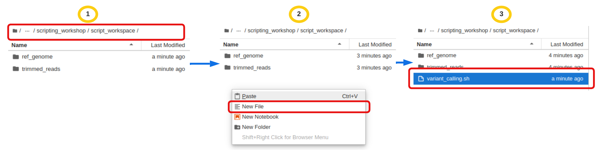

# Automating a Variant Calling Workflow

!!! clipboard-list "Aim"

    - Put all the steps from the previous lesson into a script.

### Variant calling workflow


!!! rectangle-list "Remember our variant calling workflow has the following steps:"

    - Index the reference genome for use by bwa and samtools.
    - Align reads to reference genome.
    - Convert the format of the alignment to sorted BAM, with some intermediate steps.
    - Calculate the read coverage of positions in the genome.
    - Detect the single nucleotide variants (SNVs).
    - Filter and report the SNVs in VCF (variant calling format).


!!! terminal-2 "Let's start with creating a new directory as our script working space and copy all the required resources."

    ```bash
    pwd
    ```
    **Output** - `/home/$USER/scripting_workshop`
    ```bash
    mkdir script_workspace
    ```
    ```bash
    cd script_workspace
    ```
    ```bash
    #Don't forget the  . at the end of the line
    cp -r /nesi/project/nesi02659/scripting_workshop/variant_calling/* .
    ```
    ```bash
    ls
    ```

    **Output** - `ref_genome  trimmed_reads`
    


!!! terminal-2 "Now we are ready to start building the script."

    ```bash
    nano variant_calling.sh
    ```
    <br>
    ??? jupyter "Prefer Jupyter *file* over `nano` ?"
        You are welcome to choose Jupyter interactive *file* option over `nano`. If this is your preferred option, below are the instructions on how to **create** a file

        1. **Make sure** to navigate the left file explorer to correct *path*
        2. <KBD>Right click</KBD> on the explorer to open the menu and choose `New file`
        3. Rename the file as `variant_calling.sh`

        


!!! terminal-2 "In the text editor, type the commands"

    ```bash linenums="1"
    #!/bin/bash 
    
    # Jane Doe
    # 13 April 2023
    
    # This script runs the variant calling pipeline from mapping to vcf.
    
    set -e
    # Load all the required modules
    module purge
    module load BWA/0.7.17-GCC-9.2.0
    module load SAMtools/1.13-GCC-9.2.0
    module load BCFtools/1.13-GCC-9.2.0
    
    # create the results directories
    mkdir -p results/sam results/bam results/bcf results/vcf
    
    # indexing the genome
    genome=ref_genome/ecoli_rel606.fasta
    bwa index $genome
    
    # create a loop that map reads to the genome, sort the bam files and call variants
    for fq1 in trimmed_reads/*_1.trim.sub.fastq
        do
        echo "working with file $fq1"
    
        base=$(basename $fq1 _1.trim.sub.fastq)
        echo "base name is $base"
    
       # setting the variables
       fq1=trimmed_reads/${base}_1.trim.sub.fastq
       fq2=trimmed_reads/${base}_2.trim.sub.fastq
       sam=results/sam/${base}.aligned.sam
       bam=results/bam/${base}.aligned.bam
       sorted_bam=results/bam/${base}.aligned.sorted.bam
       raw_bcf=results/bcf/${base}_raw.bcf
       variants=results/vcf/${base}_variants.vcf
       final_variants=results/vcf/${base}_final_variants.vcf
    
      # running the analysis steps
      bwa mem $genome $fq1 $fq2 > $sam
      samtools view -S -b $sam > $bam
      samtools sort -o $sorted_bam $bam
      samtools index $sorted_bam
      bcftools mpileup -O b -o $raw_bcf -f $genome $sorted_bam
      bcftools call --ploidy 1 -m -v -o $variants $raw_bcf
      vcfutils.pl varFilter $variants > $final_variants
    
    done
    ```
    <br>
    ??? hand-holding-dollar "Shell variables"
        A variable is a character string to which we assign a value. The value assigned could be a number, text, filename, device, or any other type of data. A variable is nothing more than a pointer to the actual data. The shell enables you to create, assign, and delete variables.


!!! terminal-2 "Running the script (Running the script)"

    ```bash
    bash ./variant_calling.sh
    ```


!!! tip "Adding executable permissions"

    The way the script is written means we have to indicate which program to use whenever we are running it. 
    To be able to run without calling bash, we need to change the script permissions.

    !!! terminal "script"
    
        ```bash 
        ls -l variant_calling.sh 
        ```

        **Output** `-rw-rw-r-- 1 fayfa80p fayfa80p 1401 Mar  5 22:29 variant_calling.sh`
        
        ```bash
        chmod u+x variant_calling.sh
        ```
        ```bash
        ls -l variant_calling.sh 
        ```

        **Output** - `-rwxrw-r-- 1 fayfa80p fayfa80p 1401 Mar  5 22:29 variant_calling.sh`

        - note colour change on the script filename
        
    Now we can execute the script without calling bash

    !!! terminal "script"
        ```bash
        ./variant_calling.sh
        ```

In the [Next Lesson](https://github.com/GenomicsAotearoa/Workshop-Bash_Scripting_And_HPC_Job_Scheduler/tree/main/2.HPC_Job_Scheduling) we will now prepare the script to run on the HPC environment.


