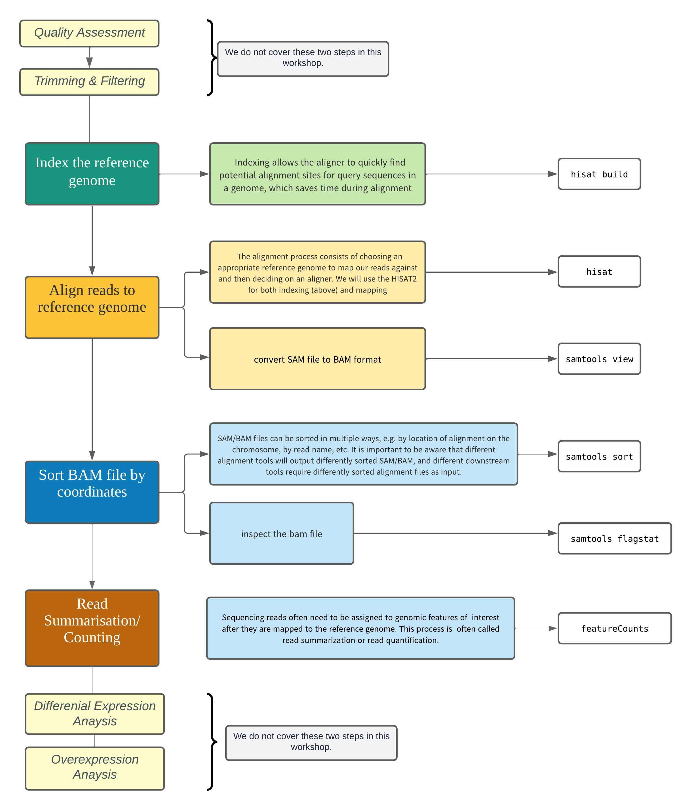

# RNA-Seq Mapping And Count Data Workflow


This material is extracted from the [RNA-seq workshop](https://github.com/GenomicsAotearoa/RNA-seq-workshop) Lesson

!!! abstract "Objectives and overall workflow"
    - To develop a pipeline that does mapping and count the number of reads that mapped then overall put all these steps into a script.
    - Understand and perform the steps involved in RNA-seq mapping and read count.
    - Use command line tools to run the pipeline.

<center>
{width="300"}
</center>


## RNA-Seq Data Analysis Workflow
<center>

</center>

### Assumptions
- You have already performed trimming and filtering of your reads and saved in a directory called trimmed_reads.
- You have a reference genome saved in a directory called ref_genome.

In this workshop, we have already trimmed the reads and downloaded the reference genome for you.
First, it is always good to verify where we are:

!!! terminal "script"

    ```bash
    cd ~/scripting_workshop
    ```
    ```bash
    pwd
    ```
    
    **Output** - `/home/$USER/scripting_workshop`


Checking to make sure we have the directory and files for the workshop.

!!! terminal "script"

    ```bash
    ls -F
    ```
    
    **Output** - `modload.sh*  rna_seq/  scheduler/  script_workspace/  variant_calling/`

!!! tip "Reminder"
    If you do not have the workshop directory, you can copy it using the command: `cp -r  /nesi/project/nesi02659/scripting_workshop/ ~`  

!!! terminal "script"

    ```bash
    cd rna_seq
    ```
    ```bash
    ls
    ```
    **Output**  - `ref_genome  trimmed_reads` 

## Alignment to a reference genome
RNA-seq generate gene expression information by quantifying the number of transcripts (per gene) in a sample. This is acompished by counting the number of transcripts that have been sequenced - the more active a gene is, the more transcripts will be in a sample, and the more reads will be generated from that transcript.

For RNA-seq, we need to align or map each read back to the genome, to see which gene produced it.
- Highly expressed genes will generate lots of transcripts, so there will be lots of reads that map back to the position of that transcript in the genome.
- The per-gene data we work with in an RNA-seq experiment are counts: the number of reads from each sample that originated from that gene.

### Preparation of the genome

To be able to map (align) sequencing reads on the genome, the genome needs to be indexed first. In this workshop we will use [HISAT2](https://www.nature.com/articles/nmeth.3317).

!!! terminal "script"

    ```bash
    cd ~/scripting_workshop/rna_seq/ref_genome
    ```
    ```bash
    #to list what is in your directory:
    ls ~/scripting_workshop/rna_seq/ref_genome
    ```
    **Output** - `Saccharomyces_cerevisiae.R64-1-1.99.gtf  Saccharomyces_cerevisiae.R64-1-1.dna.toplevel.fa`
    ```bash
    module load HISAT2/2.2.0-gimkl-2020a
    ```
    ```bash
    # index file:
    hisat2-build -p 4 -f Saccharomyces_cerevisiae.R64-1-1.dna.toplevel.fa Saccharomyces_cerevisiae.R64-1-1.dna.toplevel
    ```
    ```bash
    #list what is in the directory:
    ls ~/scripting_workshop/rna_seq/ref_genome
    ```
    ??? success "Output"
        ```bash
        Saccharomyces_cerevisiae.R64-1-1.99.gtf              Saccharomyces_cerevisiae.R64-1-1.dna.toplevel.4.ht2  Saccharomyces_cerevisiae.R64-1-1.dna.toplevel.8.ht2
        Saccharomyces_cerevisiae.R64-1-1.dna.toplevel.1.ht2  Saccharomyces_cerevisiae.R64-1-1.dna.toplevel.5.ht2  Saccharomyces_cerevisiae.R64-1-1.dna.toplevel.fa
        Saccharomyces_cerevisiae.R64-1-1.dna.toplevel.2.ht2  Saccharomyces_cerevisiae.R64-1-1.dna.toplevel.6.ht2
        Saccharomyces_cerevisiae.R64-1-1.dna.toplevel.3.ht2  Saccharomyces_cerevisiae.R64-1-1.dna.toplevel.7.ht2   
        ```

!!! bell "Arguments"
    * **-p** number of threads
    * **-f** fasta file

How many files were created during the indexing process?

## Alignment on the genome

Now that the genome is prepared. Sequencing reads can be aligned.

!!! rectangle-list "Information required"

    * Where the sequence information is stored (e.g. fastq files ...) ?
    * What kind of sequencing: Single End or Paired end ?
    * Where are stored the indexes and the genome? 
    * Where will the mapping files be stored?
  
  
  * Now, lets move one folder up (into the rna_seq folder):
  
!!! terminal "script"  

    ```bash  
    cd ..
    ```
    ```bash  
    ls    
    ```

Let's map one of our sample to the reference genome

!!! terminal "script"

    ```bash    
    pwd
    ```
    **Output**    - `/home/$USER/scripting_workshop/rna_seq/`

    ```bash
    mkdir Mapping
    ```
    ```bash
    ls
    ```
    **Output**   - `ref_genome  Mapping  trimmed_reads`

let's use a for loop to process our samples:

!!! terminal "script"

    ```bash
    cd trimmed_reads
    ```
    ```bash
    ls
    ```
    **Output** - `SRR014335-chr1.fastq  SRR014336-chr1.fastq  SRR014337-chr1.fastq  SRR014339-chr1.fastq  SRR014340-chr1.fastq  SRR014341-chr1.fastq`
    ```bash
    for filename in *
     do
     base=$(basename ${filename} .fastq)
     hisat2 -p 4 -x ../ref_genome/Saccharomyces_cerevisiae.R64-1-1.dna.toplevel -U $filename -S ../Mapping/${base}.sam --summary-file ../Mapping/${base}_summary.txt
    done
    ```


!!! bell "Arguments"

    * **-x** The basename of the index for the reference genome. 
    * **-U** Comma-separated list of files containing unpaired reads to be aligned
    * **-S** File to write SAM alignments to. By default, alignments are written to the “standard out” or “stdout” filehandle  

Now we can explore our SAM files.

!!! terminal "script"

    ```bash 
    cd ../Mapping
    ```
    ```bash
    ls
    ```
    ??? success "Output"
        ``` 
        SRR014335-chr1.sam          SRR014336-chr1_summary.txt  SRR014339-chr1.sam          SRR014340-chr1_summary.txt
        SRR014335-chr1_summary.txt  SRR014337-chr1.sam          SRR014339-chr1_summary.txt  SRR014341-chr1.sam
        SRR014336-chr1.sam          SRR014337-chr1_summary.txt  SRR014340-chr1.sam          SRR014341-chr1_summary.txt
        ```

### Converting SAM files to BAM files

The SAM file, is a tab-delimited text file that contains information for each individual read and its alignment to the genome. While we do not have time to go into detail about the features of the SAM format, the paper by Heng Li et al. provides a lot more detail on the specification.

The compressed binary version of SAM is called a BAM file. We use this version to reduce size and to allow for indexing, which enables efficient random access of the data contained within the file.

#### A quick look into the sam file

!!! terminal "script"
    ```bash
    less SRR014335-chr1.sam 
    ```
!!! heading "`.sam` header & format" 
    
    The file begins with a header, which is optional. The header is used to describe the source of data, reference sequence, method of alignment, etc., this will change depending on the aligner being used. Following the header is the alignment section. Each line that follows corresponds to alignment information for a single read. Each alignment line has 11 mandatory fields for essential mapping information and a variable number of other fields for aligner specific information. An example entry from a SAM file is displayed below with the different fields highlighted.
    
    


We will convert the SAM file to BAM format using the samtools program with the view command and tell this command that the input is in SAM format (`-S`) and to output BAM format (`-b`):

!!! terminal "script"

    ```bash
    module load SAMtools/1.13-GCC-9.2.0
    ```
    ```bash
    for filename in *.sam
     do
     base=$(basename ${filename} .sam)
     samtools view -S -b ${filename} -o ${base}.bam
    done
    ```
    ```bash
    ls
    ```
    ??? success "Output"
        ```bash
        SRR014335-chr1.bam  SRR014336-chr1.bam  SRR014337-chr1.bam  SRR014339-chr1.bam  SRR014340-chr1.bam  SRR014341-chr1.bam
        SRR014335-chr1.sam  SRR014336-chr1.sam  SRR014337-chr1.sam  SRR014339-chr1.sam  SRR014340-chr1.sam  SRR014341-chr1.sam
        ```
    

Next we sort the BAM file using the sort command from samtools. `-o` tells the command where to write the output.

!!! note

    SAM/BAM files can be sorted in multiple ways, e.g. by location of alignment on the chromosome, by read name, etc. It is important to be aware that different alignment tools will output differently sorted SAM/BAM, and different downstream tools require differently sorted alignment files as input.**

!!! terminal "script"

    ```bash
    
    for filename in *.bam
     do
     base=$(basename ${filename} .bam)
     samtools sort -o ${base}_sorted.bam ${filename}
    done
    ```


We can use samtools to learn more about the bam file as well.

#### Some stats on your mapping:

!!! terminal "script"

    ```bash    
    samtools flagstat SRR014335-chr1_sorted.bam 
    ```
    ??? success "Output"
        ```
        156984 + 0 in total (QC-passed reads + QC-failed reads)
        31894 + 0 secondary
        0 + 0 supplementary
        0 + 0 duplicates
        136447 + 0 mapped (86.92% : N/A)
        0 + 0 paired in sequencing
        0 + 0 read1
        0 + 0 read2
        0 + 0 properly paired (N/A : N/A)
        0 + 0 with itself and mate mapped
        0 + 0 singletons (N/A : N/A)
        0 + 0 with mate mapped to a different chr
        0 + 0 with mate mapped to a different chr (mapQ>=5)
        ```

- - - 

## Read Summarization
Sequencing reads often need to be assigned to genomic features of interest after they are mapped to the reference genome. This process is often called read summarization or read quantification. Read summarization is required by a number of downstream analyses such as gene expression analysis and histone modification analysis. The output of read summarization
is a count table, in which the number of reads assigned to each feature in each library is recorded.


## Counting
- We need to do some counting!
- Want to generate count data for each gene (actually each exon) - how many reads mapped to each exon in the genome, from each of our samples?
- Once we have that information, we can start thinking about how to determine which genes were differentially expressed in our study.

### Subread and FeatureCounts
- The featureCounts tool from the Subread package can be used to count how many reads aligned to each genome feature (exon).
- Need to specify the annotation informatyion (.gtf file) 
You can process all the samples at once:

!!! terminal "script"

    ```bash
    cd ~/scripting_workshop/rna_seq
    ```
    ```bash
    module load Subread/2.0.0-GCC-9.2.0
    ```
    ```bash
    pwd
    ```
    **Output**   `/home/$USER/scripting_workshop/rna_seq`
    ```bash
    mkdir Counts
    ```
    ```
    cd Counts
    ```
    ```bash
    featureCounts -a ../ref_genome/Saccharomyces_cerevisiae.R64-1-1.99.gtf -o ./yeast_counts.txt -T 2 -t exon -g gene_id ../Mapping/*sorted.bam
    ```

    !!! tip "Hint"
        If you encounter an error along the lines of `ERROR: invalid parameter:..`, first check is to make you the current working directory is `Counts`. (it's all about location, location, location 😉 )

!!! bell "**Arguments:**"

    * **-a** Name of an annotation file. GTF/GFF format by default
    * **-o** Name of output file including read counts
    * **-T** Specify the number of threads/CPUs used for mapping. 1 by default
    * **-t** Specify feature type in GTF annotation. 'exon' by default. Features used for read counting will be extracted from annotation using the provided value.
    *  **-g** Specify attribute type in GTF annotation. 'gene_id' by default. Meta-features used for read counting will be extracted from annotation using the provided value.

---
 
!!! users-line "Group Exercise"

    Now, let's work together in our groups to create an RNA-seq mapping and count script.

    1. It is safe to compile and submit the script from `/rna_seq` parent directory as it will override the existing results from above steps. Applications used in this pipeline will obey the "override" by default. However, some applications will demand the existing outputs to be deleted or use a provided flag such as `--override` (If it is available as a function of the application)
    2. On the other hand, how about we bring more structure to "results/outputs" ? .i.e. Perhaps create a **results** directory for `sam`,`bam` and `counts` sub-directories than creating `/Mapping` (for both sam and bam) and `/Counts`  ? (Similar to what we have done in Variant calling pipeline)

---

!!! pied-piper "🎊"
    At this stage we have mastered the art of writing scripts, instead of running them on the commandline, let us now run them on HPC.


