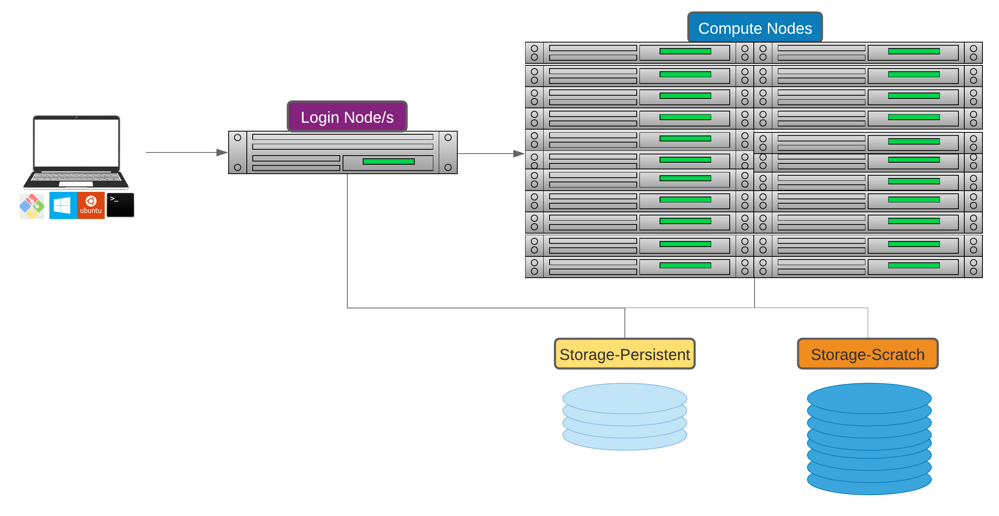

# Introduction to HPC

{width="300"}

## Defining high-performance computing

The simplest way of defining high-performance computing is by saying that it is the using of high-performance computers (HPC). However, this leads to our next question what is a HPC .

!!! quote "" 

    A high-performance computer is a network of computers in a cluster that typically share a common purpose and are used to accomplish tasks that might otherwise be too big for any one computer.

While modern computers can do a lot (and a lot more than their equivalents 10-20 years ago), there are limits to what they can do and the speed at which they are able to do this. One way to overcome these limits is to pool computers together to create a cluster of computers. These pooled resources can then be used to run software that requires more total memory, or need more processors to complete in a reasonable time.

One way to do this is to take a group of computers and link them together via a network switch. Consider a case where you have five 4-core computers. By connecting them together, you could run jobs on 20 cores, which could result in your software running faster.

### HPC architectures

Most HPC systems follow the ideas described above of taking many computers and linking them via network switches.

!!! circle-info "What distinguishes a high-performance computer from the computer clusters"

    * The number of computers/nodes 
    * The strength of each individual computer/node 
    * The network interconnect – this dictates the communication speed between nodes. The faster this speed is, the more a group of individual nodes will act like a unit.

### NeSI Mahuika Cluster architecture

NeSI Mahuika cluster (CRAY HPE CS400) system consists of a number of different node types. The ones visible to researchers are:

* Login nodes
* Compute nodes

!!! info ""
    
    === "Overview of HPC Architecture"
    
         
        {width="700"}
         

    === "Composition of a node"

          

         {width="500"}
         
 

    === "In reality"

        

        {width="700"}
        

!!! jupyter "Jupyter Terminal"
    * Jupyter terminal should be treated as a **login** node. .i.e. Just like what we have done so far; use it to develop, test and debug scripts but do not to deploy the production level workflow interactively.   
  
- - - 

<b><a href="https://genomicsaotearoa.github.io/Workshop-Bash_Scripting_And_HPC_Job_Scheduler/">Back to homepage</a></b>

