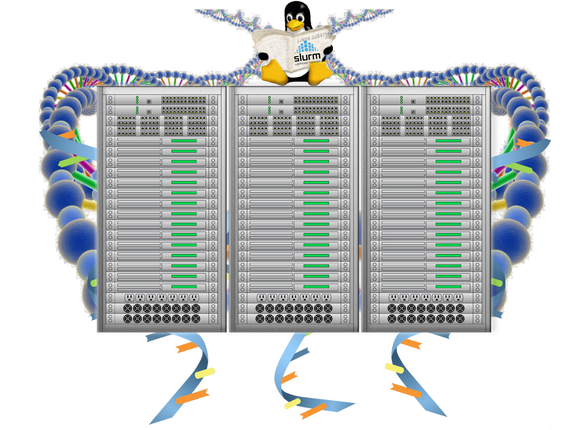

{width="300"}

# **Introduction to Bash Scripting and HPC Scheduler**
 

{width="450"}

This as an **Introductory** level workshop on *Bash Scripting and HPC Job Scheduler, Slurm*.

!!! check-to-slot "Prerequisites"

    - Familiarity with terminal and basic linux commands
    - Intermediate level knowledge on Molecular Biology and Genetics

    **Recommended but not required**

    -  Attend [Genomics Data Carpentry](https://datacarpentry.org/genomics-workshop/) and [RNA-Seq Data Analysis](https://genomicsaotearoa.github.io/RNA-seq-workshop/) workshops

!!! square-xmark "Some of the things we won't cover in this workshop"

     - Domain specific concepts in
         - Genetics, Genomics and DNA Sequencing 
         - Variant Calling
         - RNA sequencing and data analysis

!!! screwdriver-wrench "Setup"

    Workshop material is designed to run on NeSI Mahuika cluster via Jupyter. Instructions on how to Set/Reset Authentication factors to access NeSI Services and Jupyter Login instructions [can be found here](https://dinindusenanayake.github.io/ganesi_authesetup-login/)

!!! rectangle-list "Content"
    | **Lesson**                                        | **Overview** | 
    |:---------------------------------------------------|:-------------|
    |[1. Designing a Variant Calling Workflow](./1_DesigningVariantC.md){ .md-button .md-button--primary }||
    |[2. Automating a Variant Calling Workflow](./2_AutomaticVariantC.md){ .md-button .md-button--primary }||
    |[3. RNA-seq Mapping And Count Data Workflow](./3_RNAseq.md){ .md-button .md-button--primary }||
    |[4. Introduction to HPC](./4_IntroductiontoHPC.md){ .md-button .md-button--primary }|Introduction to High Performance Computing|
    |[5. Working with Job Scheduler](./5_working_with_job_scheduler.md){ .md-button .md-button--primary }|Introduction to HPC Job Schedulers, Slurm Scheduler & life cycle of a Slurm job, Assessing resource utilisation and profiling|
    |[6. Supplementary #1](./6_supplementary_1.md){ .md-button .md-button--primary }||
    |[7. Supplementary #2](./7_supplementary_2.md){ .md-button .md-button--primary }||
    |[8. Supplementary #3](./8_supplementary_3.md){ .md-button .md-button--primary }||

