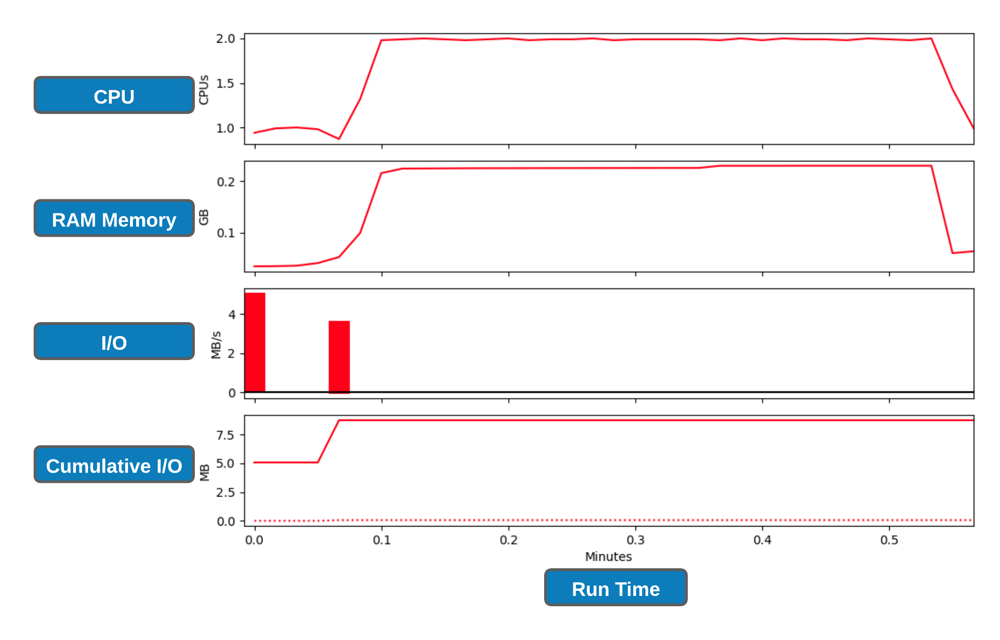

## slurm profiling

Although `nn_seff` command is a quick and easy way to determine the resource utilisation, it relies on **peak** values (data gets recorded every 30 seconds) which doesn't allows us to examine resource usage over the run-time of the job. There are number of in-built/external tools to achieve the latter which will require some effort to understand its deployment, tracing and interpretation. Therefore, we will use **slurm native profiling** to evaluate resource usage over run-time. This is a simple and elegant solution.

### Exercise S.2.1


```bash
#Change the working directory to Exercise_4.4
$ cd /nesi/project/nesi02659/sismonr_workshop/workingdir/$USER/Exercise_4.4

#Run ls command and you should see three files (one .R,sl and one .py - We will discuss the purpose of this .py file after submitting the job) and one directory named slurmout
$ ls -F
example1_arraysum.R  example1_arraysum.sl  profile_plot_Jul2020.py  slurmout/

#Review the slurm script with cat Or another text editor and submit with sbatch
$ sbatch example1_arraysum.sl 
```
    
* Do take a note of the **JOBID** as we are going to need it for next step. Otherwise, we use `squeue -u $USER` OR `sacct` command as before to monitor the status
* Also, you can `watch` the status of this job via `$ watch -n 1 -d "squeue -j JOBID"`. 
    *  `watch` command execute a program periodically, showing output fullscreen. Exiting the `watch` screen by done by pressing `Ctrl+x` 

* Let's create slurm profile graphs

```bash

#collate the data into an HDF5 file using the command. Replace **JOBID** with the corresponding number 
$ sh5util -j JOBID
sh5util: Merging node-step files into ./job_JOBID.h5

#execute the script on .h5 file. We will need one of the Python 3 modules to do this. Ignore the deprecating warning. 
$ module purge 
$ module load Python/3.8.2-gimkl-2020a

#Replace **JOBID** with the corresponding number
$ python profile_plot_Jul2020.py job_JOBID.h5

#This should generate a .png file where the filename is in the format of job_23258404_profile.png
``` 

<br>
<p align="center"></p> 
<br>



